# GameProject_Ookun

Ookun, A TopDown RPG game made in Unity game engine using C# 

#### Here are some screenshots

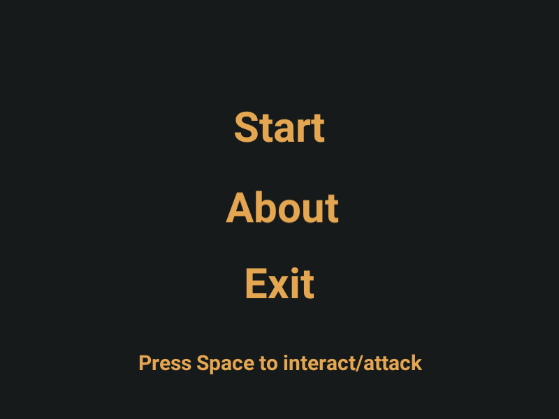

##### => The OverWold

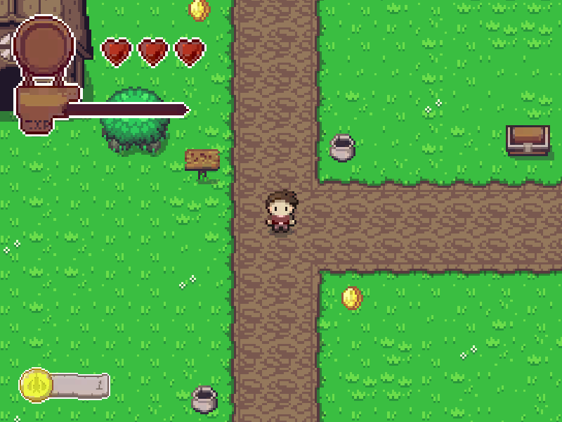

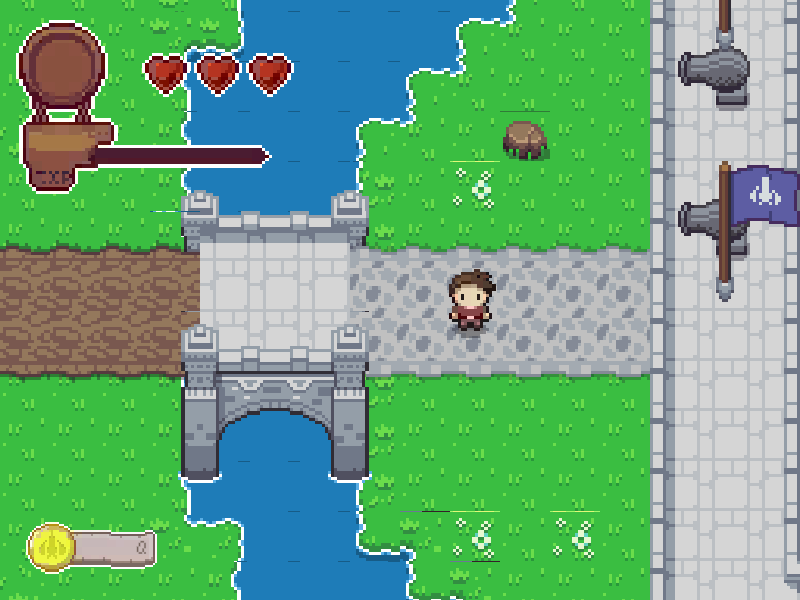

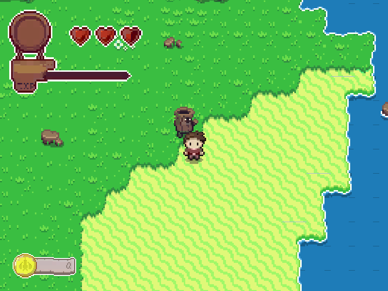

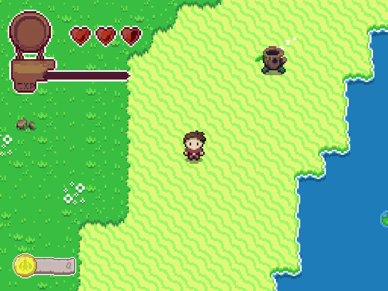

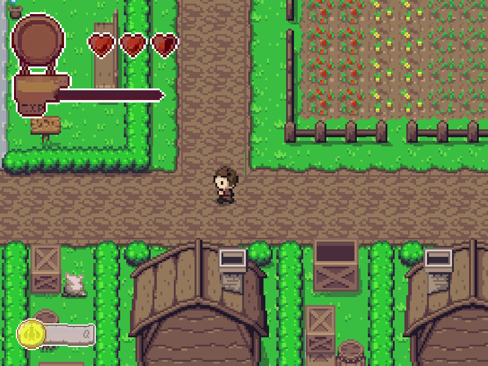

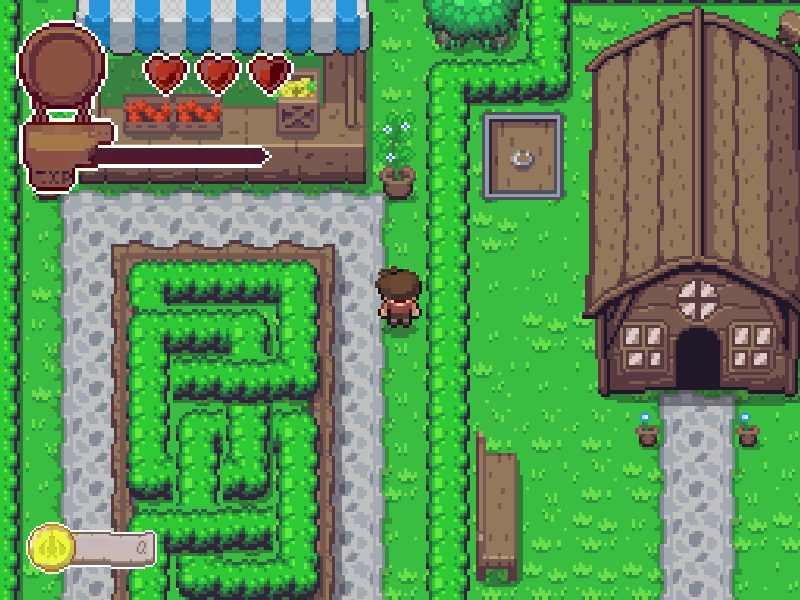

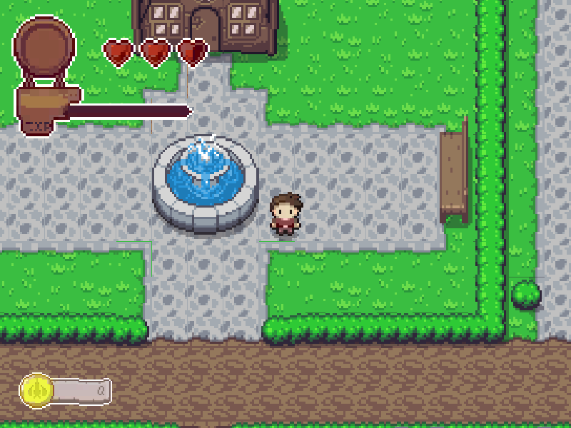

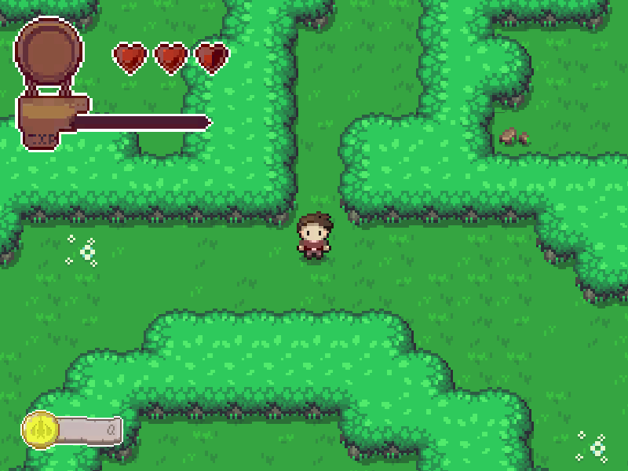

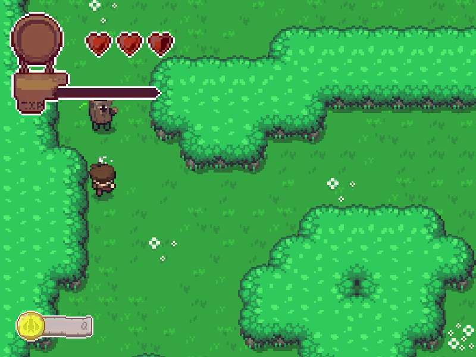

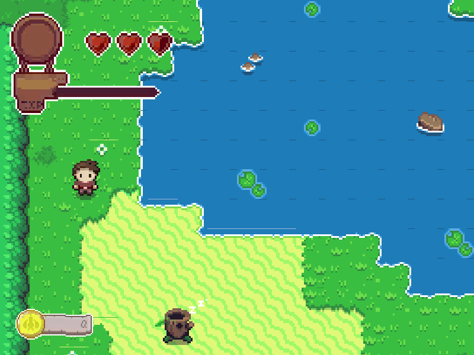

##### => The House

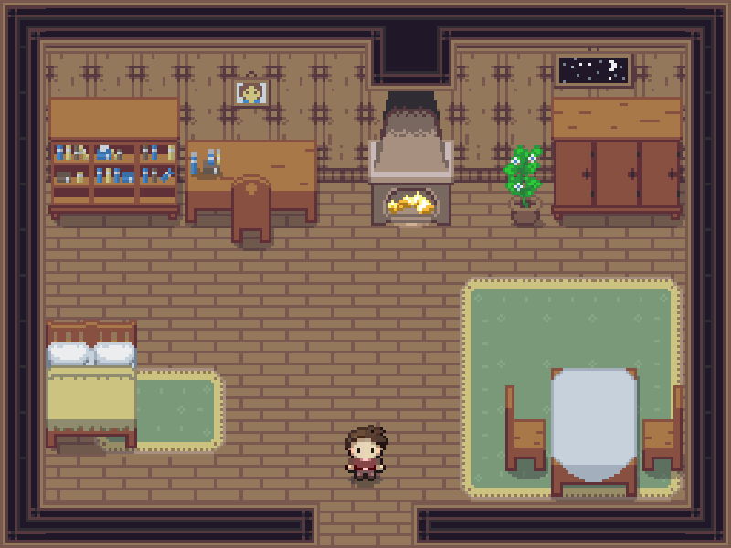

##### => The Dungeon

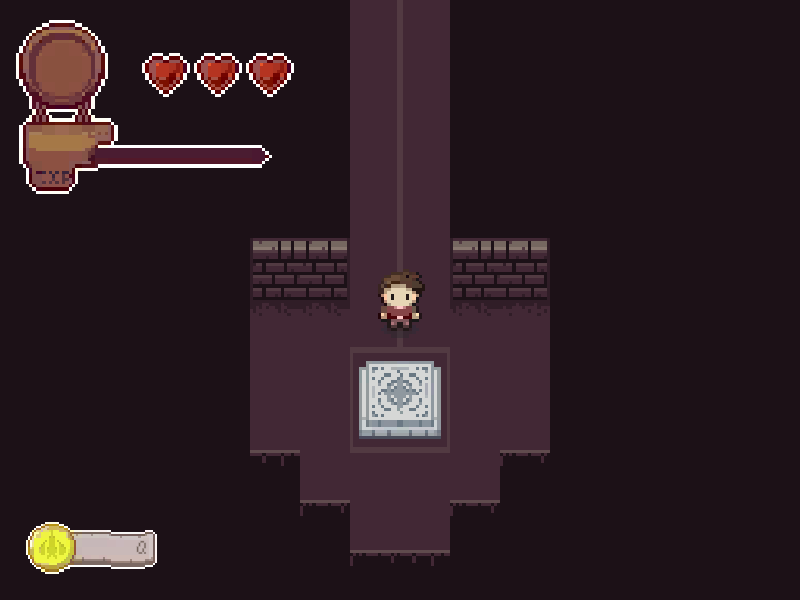

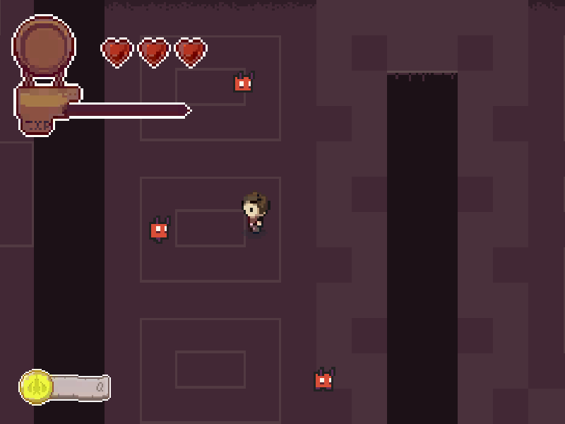

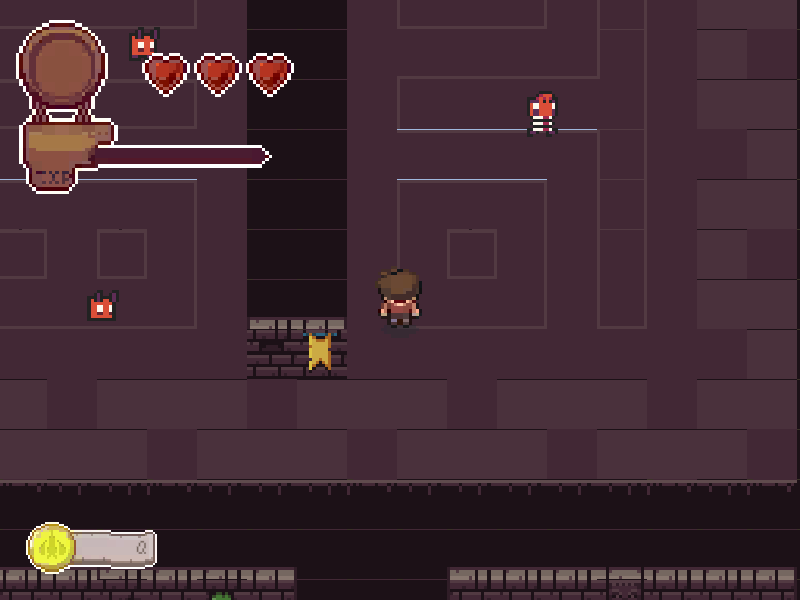